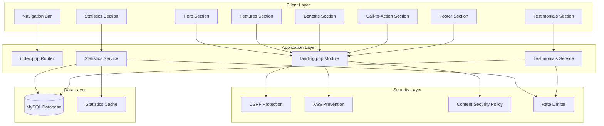
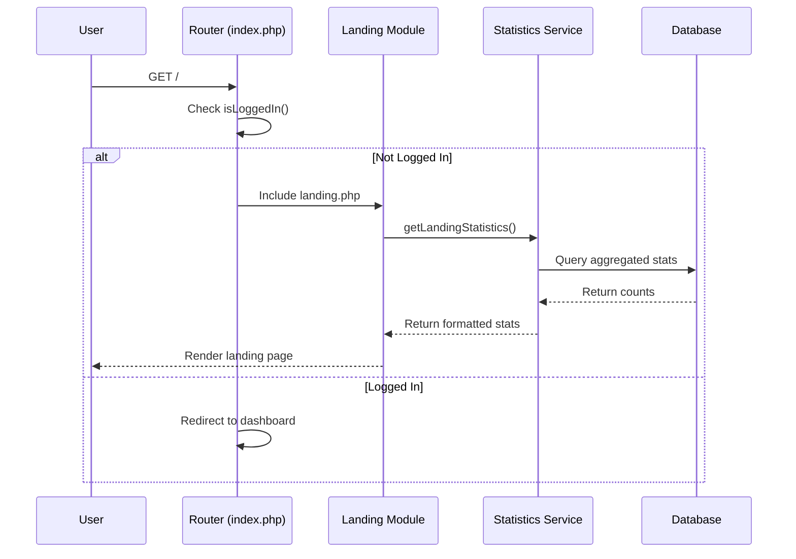
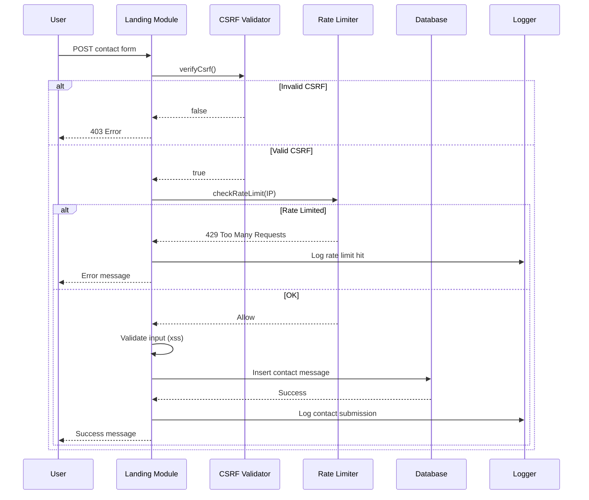

# Design Document: Landing Page Premium

## Overview

This document defines the technical design for the SEMAR Landing Page Premium feature. The landing page serves as the public-facing entry point for unauthenticated users, showcasing the application's capabilities before login while maintaining the glassmorphism design aesthetic established in the existing login page.

### Design Goals

1. **Visual Continuity**: Maintain consistent glassmorphism styling with the existing login page
2. **Security First**: Integrate seamlessly with existing security infrastructure (CSRF, XSS prevention, CSP)
3. **Performance**: Optimize for fast initial load with lazy loading and efficient asset delivery
4. **Accessibility**: WCAG 2.1 AA compliance with proper semantic HTML and keyboard navigation
5. **Responsive**: Mobile-first design with clear breakpoints for tablet and desktop

### Technology Stack

- **Backend**: PHP 8.x (no framework, matches existing codebase)
- **Frontend**: Vanilla JavaScript (no build tools, matches existing pattern)
- **Styling**: CSS3 with CSS Custom Properties (matches existing main.css)
- **Database**: MySQL/MariaDB (existing database)
- **External Dependencies**: Font Awesome 6.5, Google Fonts (Inter, Outfit)

---

## Architecture

### System Context

```
┌─────────────────────────────────────────────────────────────────┐
│                         Browser (Client)                         │
│  ┌─────────────┐  ┌─────────────┐  ┌─────────────────────────┐  │
│  │   Visitor   │  │ Auth User   │  │   Search Engine Bot     │  │
│  └──────┬──────┘  └──────┬──────┘  └─────────────┬───────────┘  │
└─────────┼────────────────┼───────────────────────┼──────────────┘
          │                │                       │
          ▼                ▼                       ▼
┌─────────────────────────────────────────────────────────────────┐
│                    Web Server (Apache/Nginx)                     │
│  ┌───────────────────────────────────────────────────────────┐  │
│  │                    .htaccess (CSP, Security Headers)       │  │
│  └───────────────────────────────────────────────────────────┘  │
└─────────────────────────────────────────────────────────────────┘
          │
          ▼
┌─────────────────────────────────────────────────────────────────┐
│                      PHP Application                             │
│  ┌────────────┐  ┌────────────┐  ┌────────────┐  ┌───────────┐  │
│  │ index.php  │  │ landing.php│  │ config.php │  │functions.php│ │
│  │  (Router)  │──▶  (Module)  │  │   (DB)     │  │ (Security) │  │
│  └────────────┘  └────────────┘  └────────────┘  └───────────┘  │
└─────────────────────────────────────────────────────────────────┘
          │
          ▼
┌─────────────────────────────────────────────────────────────────┐
│                      MySQL Database                              │
│  ┌────────────┐  ┌────────────┐  ┌────────────┐                 │
│  │  risiko    │  │  mitigasi  │  │   users    │  ...            │
│  └────────────┘  └────────────┘  └────────────┘                 │
│  ┌────────────┐  ┌────────────┐                                  │
│  │landing_testimonials│ │landing_stats_cache│ (new tables)      │
│  └────────────┘  └────────────┘                                  │
└─────────────────────────────────────────────────────────────────┘
```

### Component Diagram



### Data Flow

#### Unauthenticated User Flow



#### Contact Form Submission Flow



---

## File Structure

### New Files to Create

```
manrisv2/
├── modules/
│   └── landing.php              # Main landing page module (new)
├── assets/
│   ├── css/
│   │   └── landing.css          # Landing page specific styles (new)
│   └── js/
│       └── landing.js           # Landing page interactions (new)
├── includes/
│   └── functions.php            # Add rate limiting functions (modify)
└── index.php                    # Add landing route (modify)
```

### Database Schema Changes

#### New Table: `landing_testimonials`

```sql
CREATE TABLE `landing_testimonials` (
    `id` INT UNSIGNED NOT NULL AUTO_INCREMENT,
    `user_name` VARCHAR(100) NOT NULL,
    `user_role` VARCHAR(100) NOT NULL,
    `unit_kerja` VARCHAR(150) NOT NULL,
    `testimonial_text` TEXT NOT NULL,
    `is_active` TINYINT(1) NOT NULL DEFAULT 1,
    `display_order` INT UNSIGNED NOT NULL DEFAULT 0,
    `created_at` TIMESTAMP NOT NULL DEFAULT CURRENT_TIMESTAMP,
    `updated_at` TIMESTAMP NOT NULL DEFAULT CURRENT_TIMESTAMP ON UPDATE CURRENT_TIMESTAMP,
    PRIMARY KEY (`id`),
    INDEX `idx_active_order` (`is_active`, `display_order`)
) ENGINE=InnoDB DEFAULT CHARSET=utf8mb4 COLLATE=utf8mb4_unicode_ci;
```

#### New Table: `landing_statistics_cache`

```sql
CREATE TABLE `landing_statistics_cache` (
    `stat_key` VARCHAR(50) NOT NULL,
    `stat_value` INT UNSIGNED NOT NULL DEFAULT 0,
    `updated_at` TIMESTAMP NOT NULL DEFAULT CURRENT_TIMESTAMP ON UPDATE CURRENT_TIMESTAMP,
    PRIMARY KEY (`stat_key`)
) ENGINE=InnoDB DEFAULT CHARSET=utf8mb4 COLLATE=utf8mb4_unicode_ci;

-- Initial seed data
INSERT INTO `landing_statistics_cache` (`stat_key`, `stat_value`) VALUES
    ('total_risiko', 0),
    ('total_mitigasi', 0),
    ('total_pengguna', 0),
    ('total_unit_kerja', 0);
```

#### New Table: `contact_submissions` (Optional - for contact form)

```sql
CREATE TABLE `contact_submissions` (
    `id` INT UNSIGNED NOT NULL AUTO_INCREMENT,
    `name` VARCHAR(100) NOT NULL,
    `email` VARCHAR(150) NOT NULL,
    `subject` VARCHAR(200) DEFAULT NULL,
    `message` TEXT NOT NULL,
    `ip_address` VARCHAR(45) NOT NULL,
    `user_agent` VARCHAR(255) DEFAULT NULL,
    `is_read` TINYINT(1) NOT NULL DEFAULT 0,
    `created_at` TIMESTAMP NOT NULL DEFAULT CURRENT_TIMESTAMP,
    PRIMARY KEY (`id`),
    INDEX `idx_created` (`created_at`),
    INDEX `idx_ip` (`ip_address`)
) ENGINE=InnoDB DEFAULT CHARSET=utf8mb4 COLLATE=utf8mb4_unicode_ci;
```

---

## Component Specifications

### 1. Navigation Bar Component

**Purpose**: Fixed top navigation with logo and login button

**Visual Design**:
- Glassmorphism background: `rgba(255, 255, 255, 0.07)` with `backdrop-filter: blur(20px)`
- Height: 72px on desktop, 64px on mobile
- Sticky positioning with smooth scroll behavior

**HTML Structure**:
```html
<nav class="landing-nav" id="landingNav">
    <div class="landing-nav-inner">
        <a href="<?= APP_URL ?>/" class="landing-nav-brand">
            /assets/img/logo.png" alt="SEMAR Logo" class="landing-nav-logo">
            <span class="landing-nav-title">SEMAR</span>
        </a>
        <div class="landing-nav-actions">
            <a href="<?= APP_URL ?>/?page=login" class="btn btn-landing-login">
                <i class="fas fa-sign-in-alt"></i> Masuk
            </a>
        </div>
    </div>
</nav>
```

**CSS Specifications**:
```css
.landing-nav {
    position: fixed;
    top: 0;
    left: 0;
    right: 0;
    z-index: 1000;
    background: rgba(15, 23, 42, 0.85);
    backdrop-filter: blur(20px);
    -webkit-backdrop-filter: blur(20px);
    border-bottom: 1px solid rgba(255, 255, 255, 0.1);
    transition: all 0.3s ease;
}

.landing-nav.scrolled {
    background: rgba(15, 23, 42, 0.95);
    box-shadow: 0 4px 30px rgba(0, 0, 0, 0.3);
}
```

### 2. Hero Section Component

**Purpose**: Main landing area with value proposition and CTAs

**Visual Design**:
- Full viewport height with gradient background matching login page
- Animated orb elements for visual interest
- Glassmorphism card for content

**HTML Structure**:
```html
<section class="landing-hero" id="hero">
    <div class="orb orb1"></div>
    <div class="orb orb2"></div>
    <div class="orb orb3"></div>
    
    <div class="landing-hero-content">
        <div class="landing-hero-badge">
            <span class="live-dot"></span>
            Sistem Manajemen Risiko
        </div>
        
        <h1 class="landing-hero-title">
            SEMAR
            <span class="landing-hero-acronym">Sistem Informasi Manajemen Risiko</span>
        </h1>
        
        <p class="landing-hero-subtitle">
            Solusi komprehensif untuk identifikasi, analisis, dan mitigasi risiko 
            di Balai Besar Laboratorium Kesehatan Lingkungan
        </p>
        
        <div class="landing-hero-actions">
            <a href="<?= APP_URL ?>/?page=login" class="btn btn-hero-primary">
                <i class="fas fa-sign-in-alt"></i> Masuk ke Sistem
            </a>
            <a href="#features" class="btn btn-hero-ghost">
                <i class="fas fa-arrow-down"></i> Pelajari Lebih Lanjut
            </a>
        </div>
    </div>
</section>
```

### 3. Features Section Component

**Purpose**: Display key application features in card grid

**Visual Design**:
- 3-column grid on desktop, 2 on tablet, 1 on mobile
- Glassmorphism cards with hover effects
- Icon + title + description format

**Feature Data Structure**:
```php
$features = [
    [
        'icon' => 'fa-chart-pie',
        'title' => 'Dashboard Interaktif',
        'description' => 'Visualisasi data risiko secara real-time dengan statistik dan grafik interaktif'
    ],
    [
        'icon' => 'fa-shield-alt',
        'title' => 'Manajemen Risiko',
        'description' => 'Identifikasi dan kalkulasi skor risiko secara otomatis dengan matriks standar'
    ],
    [
        'icon' => 'fa-tasks',
        'title' => 'Aksi Mitigasi',
        'description' => 'Pantau pelaksanaan mitigasi dengan upload bukti dan tanda tangan digital'
    ],
    [
        'icon' => 'fa-robot',
        'title' => 'Saran Mitigasi AI',
        'description' => 'Rekomendasi mitigasi otomatis berbasis kecerdasan buatan'
    ],
    [
        'icon' => 'fa-file-export',
        'title' => 'Export Laporan',
        'description' => 'Buat laporan profesional dalam format Excel dan PDF'
    ],
    [
        'icon' => 'fa-users-cog',
        'title' => 'Manajemen Pengguna',
        'description' => 'Kontrol akses berbasis role dengan permission granular'
    ]
];
```

### 4. Statistics Section Component

**Purpose**: Display real-time system statistics with animated counters

**Visual Design**:
- Contrasting background (darker gradient)
- 4-column grid on desktop, 2 on mobile
- Animated number counting on scroll into view

**PHP Service Function**:
```php
/**
 * Get landing page statistics.
 * Uses cached values with 5-minute TTL for performance.
 */
function getLandingStatistics(): array {
    $db = getDB();
    $cacheKey = 'landing_stats_' . date('YmdHi'); // Per-minute cache key
    
    // Try cache first
    $stats = getLandingStatsCache();
    if ($stats !== null) {
        return $stats;
    }
    
    // Query actual counts
    $stats = [
        'total_risiko' => (int)$db->query("SELECT COUNT(*) FROM risiko WHERE deleted_at IS NULL")->fetch_column(),
        'total_mitigasi' => (int)$db->query("SELECT COUNT(*) FROM mitigasi WHERE deleted_at IS NULL")->fetch_column(),
        'total_pengguna' => (int)$db->query("SELECT COUNT(*) FROM users WHERE aktif = 1")->fetch_column(),
        'total_unit_kerja' => (int)$db->query("SELECT COUNT(DISTINCT unit_kerja) FROM users WHERE unit_kerja IS NOT NULL AND unit_kerja != ''")->fetch_column(),
    ];
    
    // Update cache
    updateLandingStatsCache($stats);
    
    return $stats;
}
```

### 5. Testimonials Section Component

**Purpose**: Display user testimonials in a carousel/slider

**Visual Design**:
- Card-based layout with glassmorphism
- Carousel navigation on mobile
- User name, role, and testimonial text

**PHP Service Function**:
```php
/**
 * Get active testimonials for landing page.
 */
function getLandingTestimonials(int $limit = 6): array {
    $db = getDB();
    $stmt = $db->prepare("
        SELECT user_name, user_role, unit_kerja, testimonial_text 
        FROM landing_testimonials 
        WHERE is_active = 1 
        ORDER BY display_order ASC, created_at DESC 
        LIMIT ?
    ");
    $stmt->bind_param('i', $limit);
    $stmt->execute();
    $result = $stmt->get_result()->fetch_all(MYSQLI_ASSOC);
    $stmt->close();
    return $result ?: [];
}
```

---

## CSS Architecture and Design Tokens

### Design Tokens (CSS Custom Properties)

```css
:root {
    /* Landing Page Specific - Extends main.css variables */
    --landing-bg-gradient: linear-gradient(135deg, #0f172a 0%, #1e3a5f 50%, #1a5f7a 100%);
    --landing-glass-bg: rgba(255, 255, 255, 0.07);
    --landing-glass-border: rgba(255, 255, 255, 0.12);
    --landing-glass-blur: 20px;
    
    /* Typography */
    --landing-title-size: clamp(2.5rem, 5vw, 4rem);
    --landing-subtitle-size: clamp(1rem, 2vw, 1.25rem);
    
    /* Spacing */
    --landing-section-padding: clamp(80px, 10vh, 120px);
    --landing-container-max: 1400px;
    
    /* Animation */
    --landing-transition: 0.3s cubic-bezier(0.4, 0, 0.2, 1);
    
    /* Responsive Breakpoints (use in media queries) */
    /* Desktop: > 1024px */
    /* Tablet: 768px - 1024px */
    /* Mobile: < 768px */
}
```

### Responsive Breakpoints

```css
/* Mobile First Approach */

/* Base styles: Mobile (< 768px) */
.landing-section { /* mobile styles */ }

/* Tablet (768px - 1024px) */
@media (min-width: 768px) {
    .landing-section { /* tablet styles */ }
}

/* Desktop (> 1024px) */
@media (min-width: 1025px) {
    .landing-section { /* desktop styles */ }
}

/* Large Desktop (> 1400px) */
@media (min-width: 1400px) {
    .landing-section { /* large desktop styles */ }
}
```

### Glassmorphism Card Styles

```css
.landing-glass-card {
    background: var(--landing-glass-bg);
    backdrop-filter: blur(var(--landing-glass-blur));
    -webkit-backdrop-filter: blur(var(--landing-glass-blur));
    border: 1px solid var(--landing-glass-border);
    border-radius: 20px;
    padding: 24px;
    transition: all var(--landing-transition);
}

.landing-glass-card:hover {
    background: rgba(255, 255, 255, 0.1);
    border-color: rgba(255, 255, 255, 0.2);
    transform: translateY(-4px);
    box-shadow: 0 20px 40px rgba(0, 0, 0, 0.3);
}
```

---

## Security Design

### Integration with Existing Security Infrastructure

The landing page integrates with the existing security functions:

| Security Feature | Existing Function | Landing Page Usage |
|-----------------|-------------------|-------------------|
| CSRF Protection | `csrfToken()`, `csrfField()`, `verifyCsrf()` | Contact form submissions |
| XSS Prevention | `xss()`, `jsEncode()` | All dynamic output |
| URL Validation | `safeInternalUrl()` | Navigation links |
| Session Security | `hasValidSession()`, `isLoggedIn()` | Auth state check |

### Content Security Policy Configuration

The CSP headers will be configured in `.htaccess` with the following policy:

```apache
<IfModule mod_headers.c>
    Header always set Content-Security-Policy "default-src 'self'; script-src 'self' 'unsafe-inline' https://cdn.jsdelivr.net https://cdnjs.cloudflare.com; style-src 'self' 'unsafe-inline' https://fonts.googleapis.com https://cdnjs.cloudflare.com; font-src 'self' https://fonts.gstatic.com https://cdnjs.cloudflare.com; img-src 'self' data: https:; connect-src 'self'; frame-ancestors 'self'; base-uri 'self'; form-action 'self';"
</IfModule>
```

**CSP Directive Breakdown**:

| Directive | Allowed Sources | Purpose |
|-----------|----------------|---------|
| `default-src` | `'self'` | Default policy for all resource types |
| `script-src` | `'self'`, `'unsafe-inline'`, cdn.jsdelivr.net, cdnjs.cloudflare.com | Charts, DataTables, SweetAlert |
| `style-src` | `'self'`, `'unsafe-inline'`, fonts.googleapis.com, cdnjs.cloudflare.com | Google Fonts, Font Awesome, inline styles |
| `font-src` | `'self'`, fonts.gstatic.com, cdnjs.cloudflare.com | Google Fonts, Font Awesome |
| `img-src` | `'self'`, `data:`, `https:` | Images, charts, data URIs |
| `connect-src` | `'self'` | AJAX requests |
| `frame-ancestors` | `'self'` | Prevent clickjacking |
| `form-action` | `'self'` | Form submissions only to same origin |

### Rate Limiting Implementation

New functions to add to `functions.php`:

```php
/**
 * Check rate limit for a given key (IP-based, file storage).
 * Returns true if within limit, false if exceeded.
 * 
 * @param string $key Unique identifier for the action
 * @param int $maxRequests Maximum requests allowed
 * @param int $windowSeconds Time window in seconds
 * @return bool
 */
function checkRateLimit(string $key, int $maxRequests = 5, int $windowSeconds = 60): bool {
    $ip = getIPAddress();
    $ipHash = hash_hmac('sha256', $ip . ':' . $key, APP_KEY);
    $cacheFile = sys_get_temp_dir() . '/manris_rl_' . $ipHash . '.json';
    
    $now = time();
    $data = ['count' => 0, 'window_start' => $now];
    
    if (is_file($cacheFile)) {
        $cached = json_decode(file_get_contents($cacheFile), true);
        if ($cached && ($now - ($cached['window_start'] ?? 0)) < $windowSeconds) {
            $data = $cached;
        }
    }
    
    $data['count']++;
    
    if ($data['count'] > $maxRequests) {
        return false; // Rate limit exceeded
    }
    
    file_put_contents($cacheFile, json_encode($data), LOCK_EX);
    return true;
}

/**
 * Log rate limit violation for security monitoring.
 */
function logRateLimitViolation(string $key, string $context = ''): void {
    $ip = getIPAddress();
    error_log(sprintf('[manris] Rate limit exceeded: key=%s ip=%s context=%s', $key, $ip, $context));
}
```

### XSS Prevention Strategy

All dynamic content must be escaped using the appropriate function:

```php
// HTML context
<h1><?= xss($title) ?></h1>

// Attribute context
<div data-value="<?= xss($value) ?>">

// JavaScript context
<script>
    const data = <?= jsEncode($data) ?>;
</script>

// URL context
<a href="<?= xss(safeInternalUrl($link)) ?>">Link</a>
```

---

## Error Handling

### Database Error Handling

```php
/**
 * Safely get statistics with graceful degradation.
 */
function getLandingStatisticsSafe(): array {
    try {
        return getLandingStatistics();
    } catch (Throwable $e) {
        error_log('[manris] Landing stats error: ' . $e->getMessage());
        return [
            'total_risiko' => 0,
            'total_mitigasi' => 0,
            'total_pengguna' => 0,
            'total_unit_kerja' => 0,
        ];
    }
}
```

### Form Validation Error Handling

```php
/**
 * Validate contact form submission.
 * 
 * @return array ['valid' => bool, 'errors' => string[]]
 */
function validateContactForm(array $data): array {
    $errors = [];
    
    $name = trim($data['name'] ?? '');
    if (mb_strlen($name) < 2 || mb_strlen($name) > 100) {
        $errors[] = 'Nama harus antara 2-100 karakter.';
    }
    
    $email = trim($data['email'] ?? '');
    if (!filter_var($email, FILTER_VALIDATE_EMAIL)) {
        $errors[] = 'Format email tidak valid.';
    }
    
    $message = trim($data['message'] ?? '');
    if (mb_strlen($message) < 10 || mb_strlen($message) > 2000) {
        $errors[] = 'Pesan harus antara 10-2000 karakter.';
    }
    
    return ['valid' => empty($errors), 'errors' => $errors];
}
```

---

## Testing Strategy

### Unit Tests

| Component | Test Type | Description |
|-----------|-----------|-------------|
| `getLandingStatistics()` | Unit | Test with mock database, verify correct counts |
| `getLandingTestimonials()` | Unit | Test ordering and filtering |
| `checkRateLimit()` | Unit | Test rate limiting logic |
| `validateContactForm()` | Unit | Test validation rules |

### Integration Tests

| Scenario | Description |
|----------|-------------|
| Route: Unauthenticated Access | Verify landing page loads for unauthenticated users |
| Route: Authenticated Redirect | Verify logged-in users redirect to dashboard |
| Form: CSRF Validation | Test CSRF token validation on contact form |
| Form: Rate Limiting | Test rate limiting kicks in after threshold |
| Statistics: Cache Hit | Verify statistics caching works |
| Statistics: Database Fail | Verify graceful degradation on DB errors |

### Accessibility Tests

| Test | Tool | Criteria |
|------|------|----------|
| Color Contrast | WAVE, axe | WCAG AA 4.5:1 for normal text |
| Keyboard Navigation | Manual | All interactive elements focusable |
| Screen Reader | NVDA, JAWS | Proper heading hierarchy, alt text |
| Semantic HTML | W3C Validator | Valid HTML5 structure |

### Performance Tests

| Metric | Target | Tool |
|--------|--------|------|
| First Contentful Paint | < 1.5s | Lighthouse |
| Largest Contentful Paint | < 2.5s | Lighthouse |
| Total Page Size | < 500KB | Chrome DevTools |
| HTTP Requests | < 20 | Chrome DevTools |

---

## Router Integration

### Modifications to `index.php`

The landing page route must be added **before** the authentication check:

```php
// ── Tentukan halaman ──────────────────────────────────────────
$page = $_GET['page'] ?? 'landing'; // Changed default from 'dashboard' to 'landing'

// ── Landing page — accessible without auth ──────────────────────
if ($page === 'landing' || $page === '') {
    include __DIR__ . '/modules/landing.php';
    exit;
}

// ── Handle auth (login/logout) — SEBELUM output apapun ───────
if (isset($_POST['action']) || isset($_GET['action'])) {
    require_once __DIR__ . '/includes/auth.php';
}

// ── Paksa login ───────────────────────────────────────────────
if (!isLoggedIn() && $page !== 'login') {
    // Redirect to landing instead of login for better UX
    header('Location: ' . APP_URL . '/');
    exit;
}

// Already logged in accessing landing → redirect to dashboard
if (isLoggedIn() && $page === 'landing') {
    header('Location: ' . APP_URL . '/index.php?page=dashboard');
    exit;
}
```

---

## Performance Optimization

### Asset Loading Strategy

```html
<!-- Critical CSS inline for above-the-fold content -->
<style>
    /* Navigation and Hero critical styles */
    .landing-nav { /* ... */ }
    .landing-hero { /* ... */ }
</style>

<!-- Non-critical CSS loaded asynchronously -->
<link rel="preload" href="<?= APP_URL ?>/assets/css/landing.css" as="style" onload="this.onload=null;this.rel='stylesheet'">
<noscript><link rel="stylesheet" href="<?= APP_URL ?>/assets/css/landing.css"></noscript>

<!-- JavaScript deferred -->
<script src="<?= APP_URL ?>/assets/js/landing.js" defer></script>
```

### Image Optimization

- Use WebP format with JPEG fallback
- Lazy load images below the fold: `loading="lazy"`
- Responsive images with `srcset` for different screen sizes

### Caching Headers

```apache
<IfModule mod_expires.c>
    ExpiresActive On
    ExpiresByType text/css "access plus 1 week"
    ExpiresByType application/javascript "access plus 1 week"
    ExpiresByType image/webp "access plus 1 month"
    ExpiresByType image/jpeg "access plus 1 month"
    ExpiresByType image/png "access plus 1 month"
</IfModule>
```

---

## Analytics Integration

### Configuration Point

Add to `config.php` or `.env`:

```php
// Google Analytics (optional)
define('GA_TRACKING_ID', env('GA_TRACKING_ID', ''));

// In landing.php, only output if configured
<?php if (GA_TRACKING_ID !== ''): ?>
<!-- Google Analytics -->
<script async src="https://www.googletagmanager.com/gtag/js?id=<?= xss(GA_TRACKING_ID) ?>"></script>
<script>
    window.dataLayer = window.dataLayer || [];
    function gtag(){dataLayer.push(arguments);}
    gtag('js', new Date());
    gtag('config', '<?= jsEncode(GA_TRACKING_ID) ?>');
</script>
<?php endif; ?>
```

### Event Tracking

```javascript
// Track CTA button clicks
document.querySelectorAll('[data-track]').forEach(el => {
    el.addEventListener('click', () => {
        if (typeof gtag === 'function') {
            gtag('event', 'click', {
                'event_category': el.dataset.trackCategory || 'Landing',
                'event_label': el.dataset.track
            });
        }
    });
});
```

---

## SEO Optimization

### Meta Tags

```html
<title>SEMAR - Sistem Informasi Manajemen Risiko | BBLKL Kemenkes</title>
<meta name="description" content="SEMAR adalah sistem informasi manajemen risiko komprehensif untuk identifikasi, analisis, dan mitigasi risiko di Balai Besar Laboratorium Kesehatan Lingkungan.">
<meta name="keywords" content="manajemen risiko, identifikasi risiko, mitigasi, kemenkes, laboratorium kesehatan lingkungan">

<!-- Open Graph -->
<meta property="og:title" content="SEMAR - Sistem Informasi Manajemen Risiko">
<meta property="og:description" content="Sistem komprehensif untuk identifikasi, analisis, dan mitigasi risiko">
<meta property="og:type" content="website">
<meta property="og:url" content="<?= xss(APP_URL) ?>/">
<meta property="og:image" content="<?= xss(APP_URL) ?>/assets/img/og-image.png">

<!-- Twitter Card -->
<meta name="twitter:card" content="summary_large_image">
<meta name="twitter:title" content="SEMAR - Sistem Informasi Manajemen Risiko">
<meta name="twitter:description" content="Sistem komprehensif untuk identifikasi, analisis, dan mitigasi risiko">
```

### Structured Data (JSON-LD)

```html
<script type="application/ld+json">
{
    "@context": "https://schema.org",
    "@type": "WebApplication",
    "name": "SEMAR",
    "description": "Sistem Informasi Manajemen Risiko",
    "applicationCategory": "BusinessApplication",
    "operatingSystem": "Web Browser",
    "provider": {
        "@type": "Organization",
        "name": "Balai Besar Laboratorium Kesehatan Lingkungan",
        "url": "https://labkesling.kemkes.go.id"
    }
}
</script>
```

---

## Summary

This design document provides a comprehensive technical specification for implementing the SEMAR Landing Page Premium feature. The design maintains visual continuity with the existing glassmorphism aesthetic while ensuring security, performance, and accessibility requirements are met.

Key implementation priorities:

1. **Router Integration**: Modify `index.php` to support the landing route before auth check
2. **Database Schema**: Create new tables for testimonials and statistics cache
3. **Security**: Implement rate limiting and ensure all output is properly escaped
4. **Performance**: Use lazy loading, caching, and optimized asset delivery
5. **Responsive Design**: Mobile-first approach with clear breakpoints

The landing page serves as a professional, secure, and performant entry point that showcases SEMAR's capabilities while maintaining the high security standards of the existing application.
